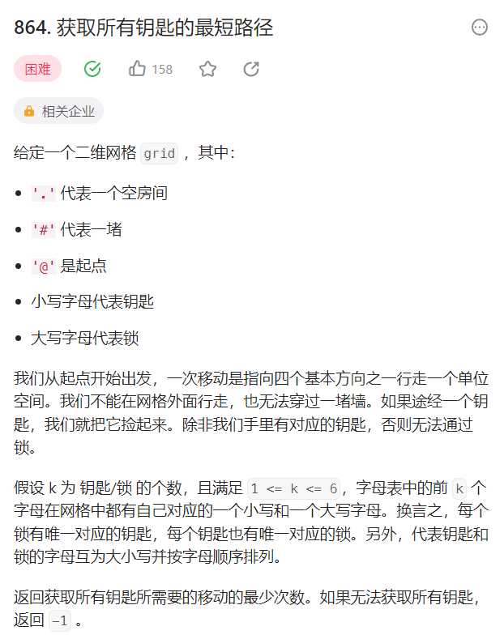
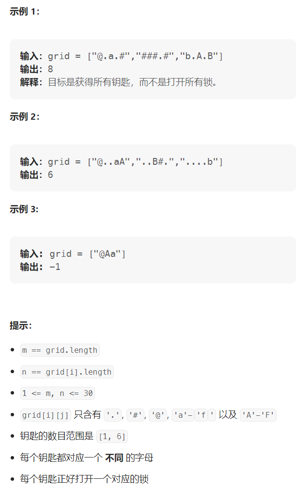

# 题目



# 输入输出



# 分析

* 这题的实质就是一个单源最短路的应用，只不过这里的边权都为1，如果边权有1和-1的话就得用双端队列去实现（AcWings1131.拯救大兵瑞恩）
* 否则我们直接用BFS去搜索即可，因为这道题的边权都为1，边权相等，用BFS求最短路即可，只需要在BFS的时候满足题目的条件即可
  * 原来一般的BFS对应距离数组dist[x][y]
  * 本题只需多一维状态存当前结点的钥匙个数即可，即dist[x][y][keyNum]
  * keyNum对应6位二进制代表六把钥匙
  * 步骤
    * 首先把距离数组全初始化为无穷大
    * 然后遍历一遍图，把起点存入队列中，把起点的dist[x][y][0]初始化为0
    * 然后从起点开始循环队列
      * 从起点开始往四个方向去搜寻
      * 如果越界或者遇到墙(即grid[x][y] == '\#')，continue
      * 否则的话我们得分类讨论
        * 如果遇到钥匙
          * 首先对应6位钥匙的状态加上这一位钥匙
          * 即temp  = t.keyNum | 1 << ( c - 'a')
          * 然后再判断对应dist[x][y][temp]是否小于原来的dist[t.x][t.y][t.keyNum] + 1
            * 如果小于的话，更新状态，并插入队列
            * 这里还需要判断如果所有门对应的钥匙都找到的话，直接返回结果
        * 如果遇到门
          * 首先判断当前6位钥匙的状态能不能开这个门
            * 如果能开的话
            * 然后再判断对应dist[x][y][t.keyNum]是否小于原来的dist[t.x][t.y][t.keyNum] + 1
              * 如果小于的话，更新状态，并插入队列
        * 如果遇到空房间
          * 判断对应dist[x][y][t.keyNum]是否小于原来的dist[t.x][t.y][t.keyNum] + 1
            * 如果小于的话，更新状态，并插入队列
    * 最后return -1表示无法获取所有钥匙

# 代码如下

```cpp
/*
 * @lc app=leetcode.cn id=864 lang=cpp
 *
 * [864] 获取所有钥匙的最短路径
 */

// @lc code=start

class Solution {
public:
    struct Node{
        int x,y,keyNum;
    };
    int dist[35][35][1 << 6];
    queue<Node> q;
    int shortestPathAllKeys(vector<string>& grid) {
        memset(dist,0x3f,sizeof dist);
        int m = grid.size(),n = grid[0].size(),lock = 0;
        for(int i = 0;i < m;i++){
            for(int j = 0;j < n;j++){
                if(grid[i][j] == '@'){
                    dist[i][j][0] = 0;
                    q.push({i,j,0});
                }else if (grid[i][j] >= 'A' && grid[i][j] <= 'Z'){
                    lock++;
                }
            }
        }
        int dx[4] = {-1,0,1,0};
        int dy[4] = {0,1,0,-1};
        while(q.size()){
            auto t = q.front();
            q.pop();
            for(int i = 0;i < 4;i++){
                int x = t.x + dx[i],y = t.y + dy[i];
                if(x < 0 || x >= m || y < 0 || y >= n || grid[x][y] == '#') continue;
                int c = grid[x][y];
                if(c >= 'a' && c <= 'z'){
                    int temp = t.keyNum | 1 << (c - 'a');
                    if(dist[x][y][temp] > dist[t.x][t.y][t.keyNum] + 1 ){
                        dist[x][y][temp] = dist[t.x][t.y][t.keyNum] + 1;
                        if(temp == (1 << lock) - 1) return dist[x][y][temp];
                        q.push({x,y,temp});
                    }
                }else if(c >= 'A' && c <= 'Z'){
                    if(t.keyNum >> (c - 'A') & 1){
                        if(dist[x][y][t.keyNum] > dist[t.x][t.y][t.keyNum] + 1){
                            dist[x][y][t.keyNum] = dist[t.x][t.y][t.keyNum] + 1;
                            q.push({x,y,t.keyNum});
                        }
                    }
                }else{
                    if(dist[x][y][t.keyNum] > dist[t.x][t.y][t.keyNum] + 1){
                            dist[x][y][t.keyNum] = dist[t.x][t.y][t.keyNum] + 1;
                            q.push({x,y,t.keyNum});
                    }
                }
            }
        }


        return -1;

    }
};
// @lc code=end


```
