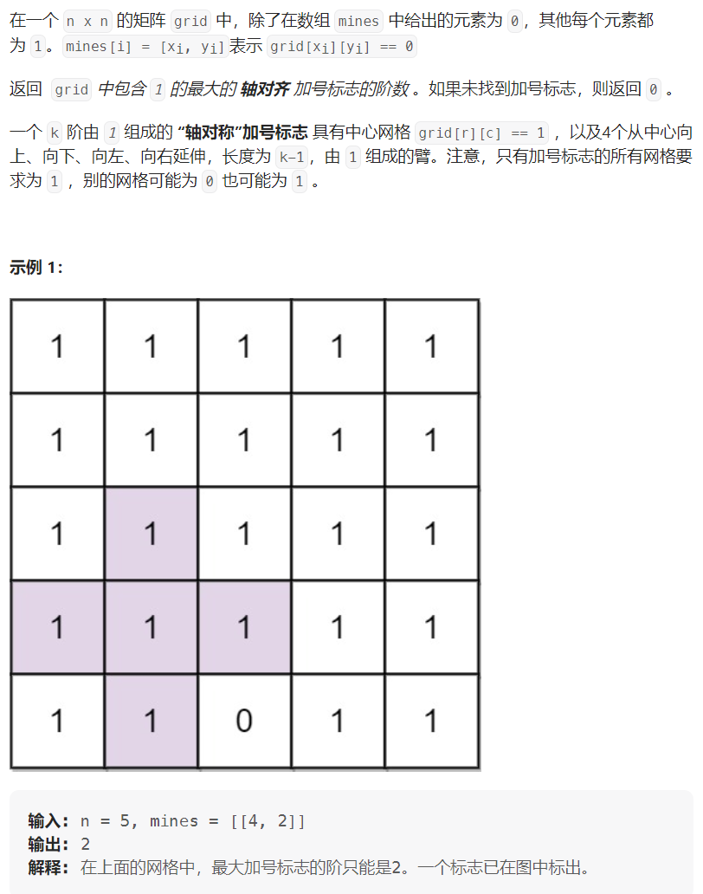
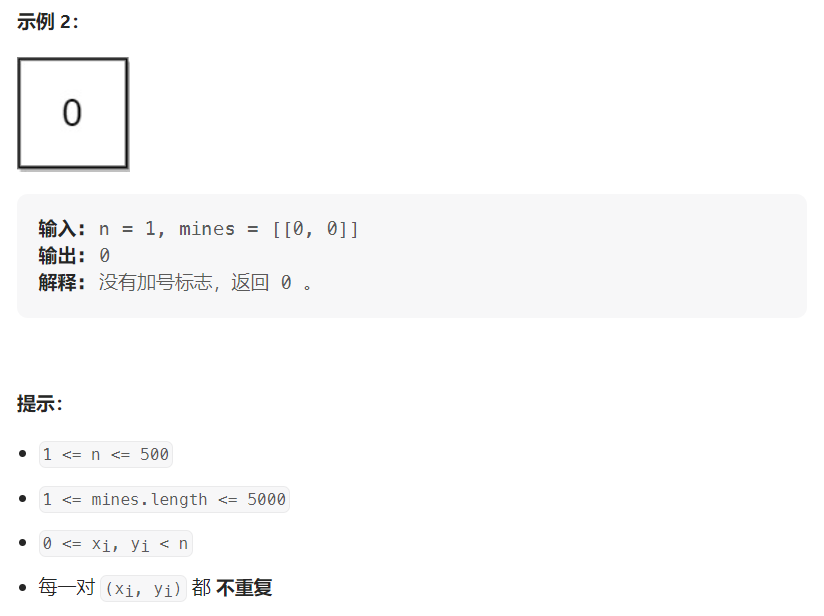

# Leetcode764.最大加号标志





# 思路

* 首先很明显能够想到的就是暴力解法，那就是遍历每个点然后每个点都向外延伸，最后求出结果，但是这么做的时间复杂度为500500*500*4很明显会超时
* 我们很容易可以判断出来每个点往四个方向延伸很明显做了很多重复的工作
* 于是我们从这个方向去简化时间复杂度
  * 我们可以从左往右、从右往左、从上往下、从下往上，这四个方向去计算每个点在对应方向上连续的1的最小值为多少
  * 遍历四次之后，我们得到的每个点对应的值就是相当于能够形成加号标志的阶数
  * 然后我们遍历所有的点，对应的最大值即为我们能够得到的最大加号标志

```cpp
/*@lc app=leetcode.cn id=764 lang=cpp[764] 最大加号标志
*/// @lc code=start
const int N = 510;
int f[N][N];
bool g[N][N];
class Solution {
public:
    int orderOfLargestPlusSign(int n, vector>& mines) {
        int ans = 0;
        memset(g,1,sizeof g);
        for(auto&e : mines){
            g[e[0]][e[1]] = 0;
        }
        //从左往右计算每个点往左最多能有多少个连续的1
        for(int i = 0;i < n;i++){
            for(int j = 0,s = 0;j < n;j++){
                if(g[i][j]) s++;
                else s = 0;
                f[i][j] = s;
            }
        }
        //从右往左计算每个点往右最多能有多少个连续的1
        for(int i = 0;i < n;i++){
            for(int j = n-1,s = 0;j >= 0;j--){
                if(g[i][j]) s++;
                else s = 0;
                f[i][j] = min(f[i][j] , s);
            }
        }
        //从上往下计算每个点往上最多能有多少个连续的1
        for(int i = 0;i < n;i++){
            for(int j = 0,s = 0;j < n;j++){
                if(g[j][i]) s++;
                else s = 0;
                f[j][i] = min(f[j][i], s);
            }
        }
        //从下往上计算每个点往下最多能有多少个连续的1
        for(int i = 0;i < n;i++){
            for(int j = n-1,s = 0;j >= 0;j--){
                if(g[j][i]) s++;
                else s = 0;
                f[j][i] = min(f[j][i], s);
                ans = max(ans,f[j][i]);
            }
        }
        return ans;
    }
};
// @lc code=end
```
